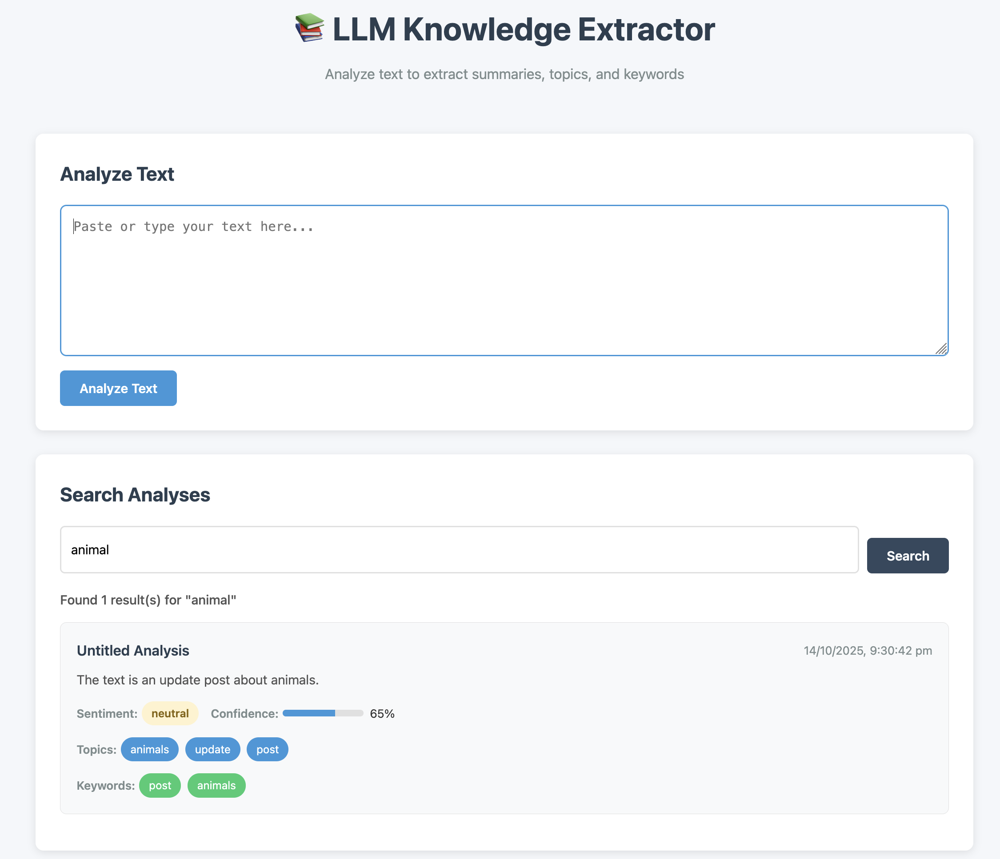

# LLM Knowledge Extractor

A prototype text analysis API that processes unstructured text using LLMs to generate summaries and extract structured
metadata.

## 📸 Screenshots

### Web Interface


*Clean, modern interface for text analysis with real-time results*

## Setup Instructions

1. **Install dependencies**:
   ```bash
   pip install -r requirements.txt
   ```

2. **Set up environment variables**:
   ```bash
   cp .env.example .env
   # Edit .env and add your OpenAI API key
   ```

   Or set it directly in your shell:
   ```bash
   export OPENAI_API_KEY="your-api-key-here"
   ```

3. **Run the application**:
   ```bash
   python main.py
   ```
    - Web UI: `http://localhost:8000`
    - API Documentation: `http://localhost:8000/docs`
    - API Info: `http://localhost:8000/api`

## API Endpoints

- **POST /analyze** - Process new text and return analysis
  ```bash
  curl -X POST "http://localhost:8000/analyze" \
    -H "Content-Type: application/json" \
    -d '{"text": "Your text here..."}'
  ```

- **GET /search?topic={topic}** - Search analyses by topic or keyword
  ```bash
  curl "http://localhost:8000/search?topic=technology"
  ```

## Features

### Web UI

- **Text Analysis**: Submit text through a clean, modern interface
- **Search**: Search through past analyses by topic or keyword
- **Browse**: View recent analyses with full metadata
- **Responsive**: Works on desktop and mobile devices

### API

- RESTful endpoints with automatic documentation
- JSON request/response format
- Comprehensive error handling

## Project Structure

```
app/
├── api/          # API endpoints and routing
├── database/     # Database models and connection
├── schemas/      # Pydantic models for request/response
├── services/     # Business logic (LLM, text processing)
├── static/       # Web UI assets (HTML, CSS, JS)
└── main.py       # FastAPI application setup

data/            # Database files (gitignored)
tests/           # Test files
scripts/         # Utility scripts
```

## Design Choices

- **FastAPI** for the web framework: Provides automatic API documentation, async support, and excellent performance with
  minimal boilerplate.
- **SQLite with SQLAlchemy**: Lightweight, file-based database perfect for prototypes, with an ORM that makes queries
  intuitive and type-safe.
- **OpenAI API**: Reliable LLM service with structured output support, making JSON extraction straightforward.
- **NLTK for keyword extraction**: Implementing noun extraction locally gives us control over the process and reduces
  API calls.
- **Modular architecture**: Clean separation of concerns with organized folder structure for better maintainability and
  scalability.

## Trade-offs Due to Time Constraints

- **Simple keyword extraction**: Used basic frequency counting rather than TF-IDF or more sophisticated NLP techniques.
- **Basic error handling**: Focused on the two required edge cases rather than comprehensive error coverage.
- **Minimal validation**: Added basic input validation but could expand with more robust schemas and constraints.

## Running Tests

Run the test suite with pytest:

```bash
pytest tests/test_main.py -v
```
